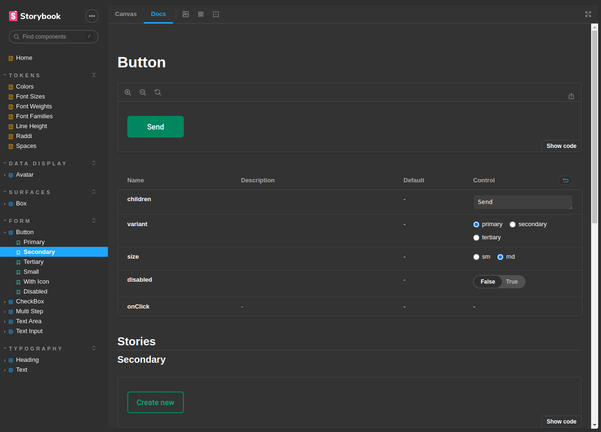

<h1 align="center">
    <a href="#"> My design system </a>
</h1>

<p align="center"> Design System  </p>

<h4 align="center"> 
	 Status: Em desenvolvimento...
</h4>

<p align="center">
 <a href="#about">About</a> •
 <a href="#components">Components</a> •
 <a href="#execute">Execute</a> • 
 <a href="#deploy">Deploy</a> • 
 <a href="#license">License</a>
</p>

<br />
<div id="about" />

## 💻 Sobre:

Projeto desenvolvido com intuito de criar um design system e uma documentação de componentes reutilizáveis. Projeto feito com:

- Stitches;
- RadixUI;
- Storybook;
- TypeScript;
- React;
- ViteJs
- TurboRepo
- Changeset

---

<br />
<div id="components" />

## Components do Design System

- [x] Text
- [x] Heading
- [x] Box
- [x] Button
- [x] TextInput
- [x] TextArea;
- [x] Checkbox
- [x] Avatar
- [x] MultiStep
- [ ] Select
- [ ] Slider
- [ ] Caroussel (V/H)
- [ ] ScrollArea
- [ ] Tooltip
- [ ] Toast
- [ ] Popover
- [ ] Modal

---

<br />
<div id="execute" />

## 🚀 Como executar o projeto.

#### 🎲 Rodando a aplicação 

```bash

# Clone este repositório
$ https://github.com/LidianeDiniz/Frontend_foodExplorer.git

# Acesse o terminal do seu sistema operacional e escolha uma pasta de sua preferencia
# cole o comando abaixo no terminal
$ git clone git@github.com:JoaoAlberto20/design-system.git


# Entre na pasta clonada com seguinte comando 
$ cd design-system

# Instale as dependências com:
$ npm install

# Rode a aplicação em modo de desenvolvimento:
$ npm run dev

# O servidor inciará na porta:6006 - acesse <  http://localhost:6006 >

```
---

<br />
<div id="deploy" />

## 🎨 Documentação do Design System

A documentação do design system está disponível aqui:  https://joaoalberto20.github.io/design-system

<a href="https://joaoalberto20.github.io/design-system">
  
</a>

<br />
<div id="license" />

## 📝 License

This project is under the license [MIT](./LICENSE).

Made with ❤️ by Lidiane Diniz  [Get in Touch!](https://www.linkedin.com/in/lidiane-cristina-diniz)

---